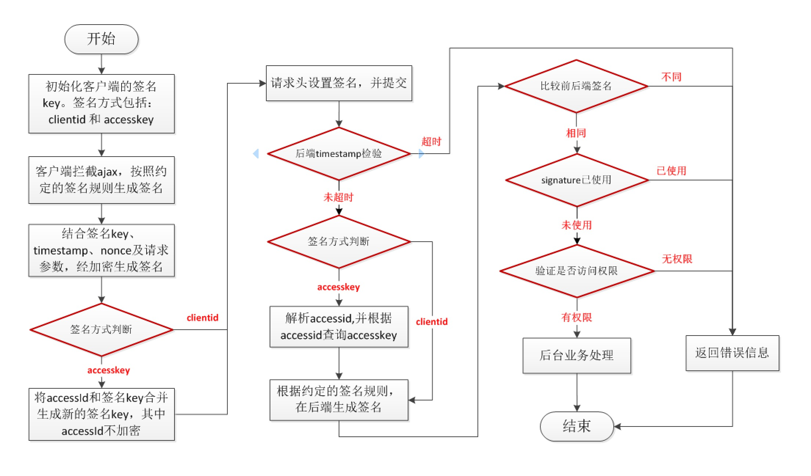
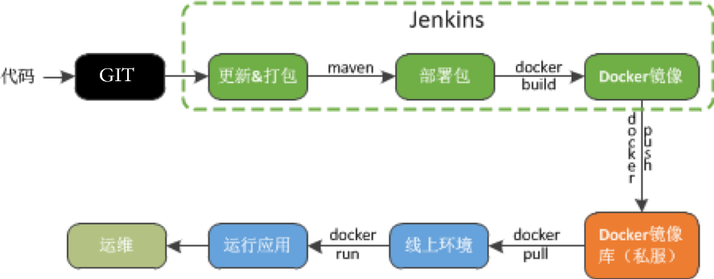

# 基础技术开发框架支撑

## 项目介绍
使用springboot搭建的基础技术开发框架，包括项目构建、依赖管理、开发过程技术、到持续集成部署的内容。
开发目的：满足项目日常开发的需求。

## 参与人员
邓世超、李振、刘振群、刘鹏。

### maven依赖管理

* 统一maven私服。私服地址：http://maven.fosung.com/nexus
  
* 依赖项统一配置。大部分依赖jar包版本已定义。

### 配置管理

* 配置文件方式。目前使用此种方式配置。

* 配置中心方式。扩展基于spring config的关系数据库存储文件方式，并配备相关管理页面（待扩展）。

### 日志管理
* 日志内容格式

* 日志文件名称及回滚配置

### 数据持久化

#### 数据源统一配置
* 基于druid的数据源连接池配置。由于DataSource涉及扩展点较多，因此，单独创建了数据源配置文件
和相关配置属性。
* 多数据源配置（待扩展）。考虑支持一个应用支持多个不同数据库连接，提供数据源选择策略。
* 分库分表配置（待扩展）。考虑基于sharding-jdbc扩展数据源，实现分库分表操作。

#### jpa(hibernate)配置
> 数据库持久化操作同时集成了jpa和mybatis，实际使用过程中建议以jpa为主，mybatis为辅。jpa处理保存、更新和简单查询操作，
mybatis主要进行批处理和复杂sql执行。

* 表结构同步策略。默认使用hibernate的update更新策略，实体类更新属性对应的表字段后，在应用启动时，
将更改内容自动同步到数据库。

* entity基础类。实体ID的类型为Long类型，并基于snowflake分布式id生成方式，生成记录ID。

* dao基础类。提供DAO持久化操作类，包含大部分表操作方法。

* service基础类。提供基于service接口类和实现类，定义了查询、更新、新增和删除相关的操作接口，并支持假删除操作。

* 数据查询支持。支持jpa分页查询、mybatis分页查询、查询条件动态配置，使查询操作更方便。

* 数据持久化支持。封装对保存和更新的操作，更新操作时明确指定更新的字段，避免误操作。

#### mybatis配置
* 与jpa兼容。在DAO接口类中方法中，通过单独注解声明为mybatis方法，剩余操作与mybatis原生操作完全相同。

* 查询结果。大部分查询的结果字段映射自动将表字段映射为类属性，避免重复字段映射问题。

* 应用场景。弥补jpa查询方面的不足，主要进行批处理和复杂sql执行。

### WEB安全管理

#### 普通WEB安全防护
* XSS攻击。默认对所有请求的参数值进行过滤并转换，避免前端提交非法字段，造成页面展示问题。同时，提供例外请求配置。

* CORS请求。过滤浏览器前端所有跨域请求，避免应用后端接口被误用。同时，提供例外请求配置。

* Referer嵌套过滤。避免应用页面被第三方嵌套调用，只能是我们允许的应用或地址可调用。同时，提供例外请求配置。

* SQL注入。提供查询SQL特殊字符的过滤，避免数据泄露。例如查询条件中带有：% 的情况过滤。

#### 后端表单验证
为了保证请求数据的完整性和有效性，在前端页面提交数据前要进行必要的表单数据验证，但是难免提交数据会被篡改 或 恶意的第三方提交
错误的参数，导致应用运行不稳定或出错。因此，后端也需要提供与前端表单验证相同的验证规则，确保接口正确性。框架中提供了两种
不同的数据验证规则。
* 实体数据验证。验证实体中属性值是否符合要求。

* 参数数据验证。验证请求处理方法中的参数值是否符合要求。

#### 请求签名
防止第三方恶意请求、防护短信炸弹等问题，客户端和服务端约定签名的key，客户端在调用时，与请求参数、请求url、请求时间、请求随机数等
一起提交校验生成签名，与请求一起提交。后端对请求签名、请求时间进行校验。参考流程图如下：

#### 用户认证
用户权限认证，可根据具体业务请求配置不同的权限策略，主要权限类型如下：
* 登录认证。自动执行登录逻辑和登录认证。

* 匿名认证。不要用户登录，不验证登录用户，所有人可以访问。

* 用户认证。登录用户认证，只要登录即可访问。

* 角色认证。验证登录用户的角色，只有登录用户有对应的角色才允许访问。

#### 数据权限控制
* 核心逻辑。目前已经实现行记录权限控制，使用流程：1.在controller层通过注解的方式配置权限信息和策略；2. 通过拦截器收集登录用户信息
、角色信息以及数据权限配置信息；3. 在service中使用指定的权限策略，进行权限信息填充、构建权限查询条件、校验数据访问权限。

* 数据访问控制。目前实现已经实现基于用户的权限控制，只有每个用户只能看到自己创建的数据。管理员可以看到所有人数据。

* 业务结合。可以通过拦截器、AOP编程和硬编码方式控制数据访问权限。

### SESSION管理
session使用有状态存储方式，在服务端存储session内容。前端页面使用cookie存储session的唯一标识。
* redis存储。使用redis存储用户回话session，对于应用系统透明。后期考虑session统一管理问题。

* 加密cookie。基于web的session有状态存储方案，在客户端使用cookie存储session唯一标识，避免cookie值滥用，对cookie值进行必要的加密。

### MVC开发

#### DTO数据处理
目前后端开发的模型使用贫血模式，实体对象多为POJO类，在后端传输数据时，需要对数据进行特殊处理，主要包含功能如下：
* 数据组合。将多个不同的对象数据、存在关联关系的数据组合为一个对象。

* 数据转换。按照业务对数据进行转换和格式化处理操作。

* 数据过滤。过滤传递给前端的字段。

* 通用数据处理。字典数据、用户名称、时间格式化、附件填充等等

#### 异常处理
系统统一的异常处理，目前处理的异常包括：
* 应用异常。

* 自定义异常处理。

* 数据验证异常。

#### 基础服务类
##### 常用util类库
所有的util类库，都是Util开头。
* UtilAnnotation。注解操作接口，获取方法、对象中声明的注解。
* UtilBeanProperty。类库属性基本操作
* UtilCollection。集合操作类
* UtilDate。日期操作类
* UtilDigest。加解密操作，包含常用算法MD5、Base64、sha128、sha256等
* UtilDomain。域名操作
* UtilEnum。枚举操作
* UtilIP。IP操作类
* UtilReflection。反射操作类
* UtilString。字符串操作类
* UtilTree。树形结构数据格式化
* UtilZip。压缩操作
* 应用序列化和反序列化

##### rest接口结果格式化

#### 运行时字典接口

#### 持续集成
持续集成目前已经使用Docker打包并发布服务共享平台的版本，持续集成流程图如下。计划验证成熟之后，在各项目推广。

#### 示例DEMO
* 访问地址：http://git.fosung.com/liupeng/framework_demo
* 数据库为：mysql，本地库名称：test，用户名/密码：root / 123qwe
* 本地redis库 

#### 待扩展功能说明
* 应用监控。监控应用节点健康状态、应用访问量、接口TPS、资源使用信息（CPU、内存等）、慢SQL统计以及其他中间件监控信息
* 运行时日志汇集。 应用节点日志统一汇集，汇集后方便统一查看和分析。
* 持续集成。运行时应用必须保证无状态，通过docker容器发布和运行应用镜像，通过镜像管理工具（k8s、swarm等）实现快速部署。
* 可视化应用配置中心。基于关系数据库实现应用的配置中心，不同环境应用运行从配置中心拉取配置，实现不同环境迁移。
* 基础功能框架。在基础功能框架中将业务系统开发需要的通用功能统一封装，业务系统只专注于开发业务系统功能。
通用功能可能包括：党建SSO、系统管理（字典、用户、角色等）、附件、消息、权限认证、session策略等等。
* 微服务化。在项目开发过程中尽量不做太细的拆分，不为了微服务而微服务化，拆分不好可能会导致项目复杂度和可维护性大大增加，
建议将通用功能统一实现，至少实现公司级复用。

